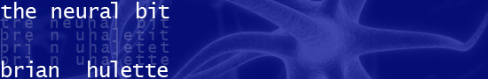

title: Anagranimation
slug: anagranimation
layout: post
category: projects
tags: javascript, d3, animation, force
date: 2015-12-8

The name of this website is an anagram. It's possible to rearrange all of the
letters in **the neural bit** to form **brian hulette**.
That's a simple concept I set out to illustrate concisely with the
site's logo. 

For the first iteration of this webpage, way back in late high
school and early college (ca. 2007), I just pulled up the Gimp, which I had
probably learned to use just the previous week, and drew up the following
image. It shows the two words in bright letters and a few intermediate
iterations with letters swapped in between them.

This gets the job done, but it leaves a lot to be desired.

After I moved to my [new static site](./this-website.html) I didn't bring the
original logo, so I was stuck without a concise illustration for a while...
until I learned about [D3](http://d3js.org). After reading some of [Mike
Bostock's](http://bost.ocks.org/mike/) excellent blog posts about
[selections](http://bost.ocks.org/mike/circles/), 
[object constancy](http://bost.ocks.org/mike/constancy/), and
[transitions](http://bost.ocks.org/mike/transition/)[ref]If you aren't familiar with
D3 and you'd like to be I would *highly* recommend you start with some of these
posts[/ref], I realized that an anagram is a perfect use case for D3's data binding
model.

Binding characters to `svg:text`
--------------------------------
The letters in a string can each be bound to `svg:text` elements, which are
positioned based on their index in the string, and then a _new_ string can
be bound with the transition between those positions animated.

We'll start by just drawing a string using a bunch of separate
`svg:text` elements. We create a selecton of `svg:text` elements, then
bind the string data to the selction. Then we grab the `enter()` selection
to get just the elements that are new, which is all of them in this case.
We then set the elements' text to that datum, and set their `x` position based 
on their index in the string.

  

  <svg id="step-1"></svg>
  

  <code>
  <pre>
  var w = 200;
  var h = 50;
  d3.select('svg#step-1')
      .attr('width', w)
      .attr('height', h);
  var the_string = 'the neural bit';
  var start = w/2 - the_string.length/2*10;
  d3.select('svg#step-1')
      .selectAll('text')
      .data(the_string)
      .enter()
      .append('text')
      .text(function(d, i) {return d; })
      .attr('y', h/2)
      .attr('x', function(d, i) { return start + i*10; });
  </pre>
  </code>
  

D3 Force Layout
---------------
