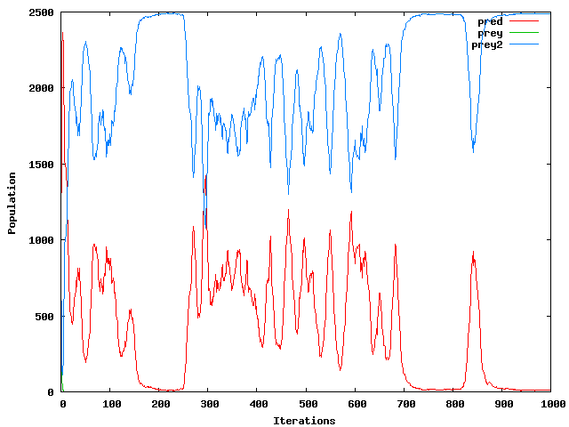
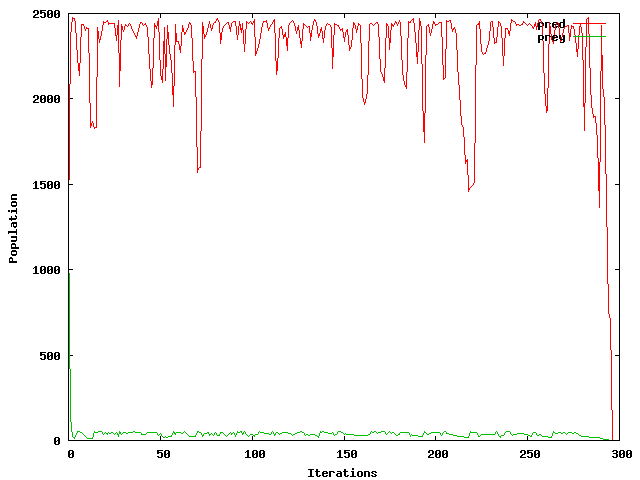
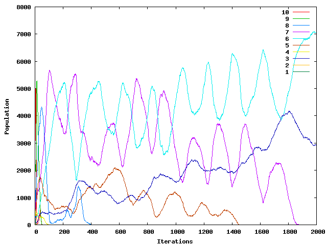

This project was inspired by two classes that I took.  The first was
Introduction to Complex Systems, which I took my senior year in high school. It
was a sort of review of a lot of interesting high level math concepts, we spent
a while talking about [fractals](http://en.wikipedia.org/wiki/Fractal) and
[the mandelbrot set](http://en.wikipedia.org/wiki/Mandelbrot_set), and then
moved on to what really interested me, cellular automata.

The idea of cellular automata is to make a lot of little cells that follow some
relatively simple rules, but when you watch their overall behavior over a lot of
iterations some interesting patterns form. The most famous example is
[conway's game of life](http://en.wikipedia.org/wiki/conway's_game_of_life).

The second class, which I took my freshman year of college was Differential
Equations 2. In this class we modeled a lot of random things t demostrate
differential equations and one such model was the populations of predators and
prey living in the same area. If you fiddle with the constants in the model just
right you can end up with two sinusoidal populations with the prey wave lagging
the predator wave a little bit. The idea is that when there are a lot of
predators, they kill off the prey, but when the prey populations gets so low,
the predators begin to starve, so the prey have time to reproduce and so on.

So one day in DE2 I began to drift off and came up with the idea of making a
predator prey simulation using cellular automata, and this is the result.

Design
------
In my simulation, the world is a square grid (I've used a 50 x 50, but it can be
changed easily). Each cell can either be filled by one of the organisms living
in the world, or it can be empty. The number of species in the simulation is not
limited to two, there can be several living together on one grid. Each of the
species has two characteristics, its **carnivore fitness** which determines
how good it is at eating other organisms, and its **herbivore fitness** which
determines how good it is at eating plants.  Both fitnesses are represented by
a number between 0 and 1.

In each iteration three things happen:
1. Eating - Each organism (non-empty cell) tries to eat the organisms around it. 
Success is based on the carivore fitness of both parties.  If the organism fails
it tries to eat a plant in the vicinity.  If the organism succeeds at either
action the food is added to the species' food reserves.

2. Starvation - Each organism tries to eat something from the species' food reserves.  
If it fails, or the species is out of food, it dies.</LI>

3. Reproduction - Each empty cell is replaced by a member of the species that
has the most members near the cell.

This idea of a food reserve seems a little funky, why not just directly feed the ones who earn the food?  Well, when I tried to implement it like that, the predators on the inside of a large group would always die.  I implemented this concept of food reserves to prevent that from happening.

Examples
--------

This is one of my first simulations.  It actually started with 3 species, 1
predator and 2 prey, but it ended up with just pred and prey 2 fighting it out.
I think this was the first time I got any sort of oscillations, so I was very excited.

I'm not entirely sure what is going on in this one, but it looks really interesting.

In this one, species 10 has a carnivore fitness of 1 and herbivore fitness of 0,
species 9 has .9 and .1, 8 has .8 and .2, etc.  I ran a bunch of simulations
with these settings, and usually one species would just end up "winning", but
this time I ended up with 4 oscillating species - really cool.

[source tarball](../code/pred-prey.tar.gz)
