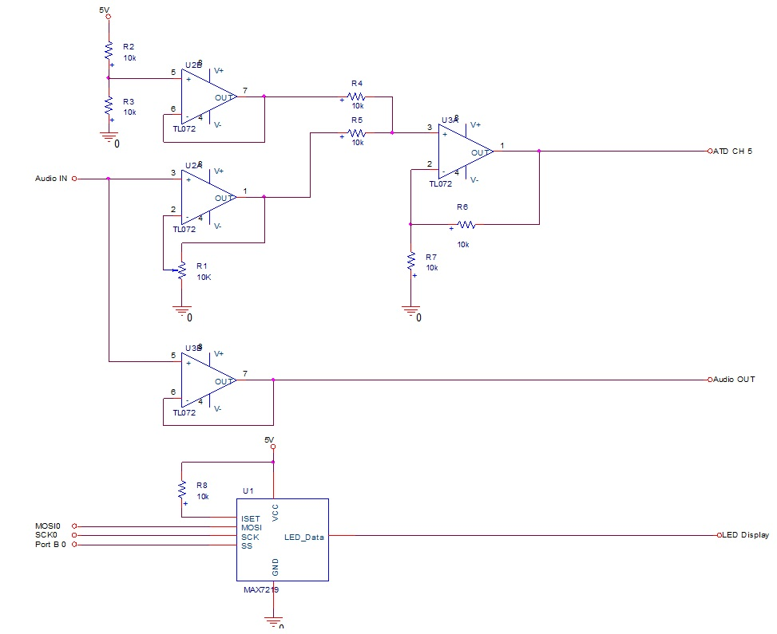

In my Embedded Systems Design class, we were required to create a final project
of our choosing which demonstrated our understanding of the course concepts. My
partner and I decided to create an Audio Visualizer for our final project. The
idea was to display the audio spectrum in real-time (calculated with an FFT) on
an LED Matrix.

Ill give a brief summary of the project here, but much more detail, and the full
code, can be found in our final report:

* [ECE331 Final Project Report](../docs/Final Report.pdf)

We decided to use this [8x8 LED Matrix](http://www.sparkfun.com/commerce/product_info.php?products_id=682)
from Sparkfun electronics. We also acquired some free samples of Maxim's
[MAX7219](http://www.maxim-ic.com/quick_view2.cfm/qv_pk/1339) LED Display driver
to drive the display. The MAX7219 allows you to control an 8x8 LED Matrix using
only a SPI bus to communicate which LEDs should be on or off.

The FFT was calculated with Freescale's MC9HCS12C128 microprocessor.  We realize
that this was sort of an unusual choice, since its not specialized for Digital
Signal Processing (DSP), but it its the processor we used throughout the quarter
in this course, and we had become quite familiar with it. We used a fixed-point
FFT library which we found <A HREF="http://www.jjj.de/fft/fftpage.html">here</A>
(we used fix_fft, the first entry).

This library was originally written by Tom Roberts, with contributions from
Malcolm Slaney and Dimitrios P. Bouras.  We made a few modifications to it so
that it will work on our processor; they are highlighted in our final report.

The last major component of the project was a simple amplifier for the audio
signal. Our Processor's ADC is configured to read voltages from 0 to 5 volts,
so we had to create a simple op-amp level shifter and amplifier to ensure the
signal stays in that range.  A schematic of all of our hardware, which includes
the op-amp circuit, can be found below.

I took a few videos of the project, to give you an idea of how it works.
The first is when we first got the project working on a breadboard:

<iframe src="http://player.vimeo.com/video/11916846?title=0&amp;byline=0&amp;portrait=0" width="400" height="300" frameborder="0">derp</iframe>

The second video shows the final product working:

<iframe src="http://player.vimeo.com/video/12518028?title=0&amp;byline=0&amp;portrait=0" width="400" height="300" frameborder="0">derp</iframe>

