In the spring of 2010 my brother and I decided we would like to launch a camera
into near-space, in order to take images of the earth from 90,000+ feet.  
We were primarily inspired by a well known project completed by some MIT
students called [Project Icarus](http://space.1337arts.com).
They became somewhat famous in the fall of 2009 by launching their vehicle into
the stratosphere for less than $150.  
We have also utilized resources from the
[UK High-Altitude Society](http://ukhas.org.uk) for various information regarding
this project.

Planning
========
Our first attempt will be based on the Project Icarus design, because we believe
it is the easiest and simplest way to achieve something like this.  However, in
the future we would like to repeat the project with more complicated launch
vehicles.

We broke the design down into three major components:
*   **Imaging:** We need a camera which can be easily modified to automatically take pictures from our launch vehicle
*   **Tracking:** When the launch vehicle returns to earth, we will need to have some sort of electronics installed in it that can report its location, so that we can recover it.
*   **Launch Vehicle:** And of course we need the vehicle itself.  It needs to protect the electronics throughout the flight.
Then we addressed each one seperately.

Imaging
=======
We decided to use a Canon camera, because we would be able to install the
[Canon Hardware Development Kit (CHDK)](http://chdk.wikia.com/wiki/CHDK) on it.  
CHDK allows you to control many settings of the camera that you dont normally
have access to, and it will allow you to write scripts to automate the camera.  

I found a [script](http://chdk.wikia.com/wiki/UBASIC/Scripts:_Ultra_Intervalometer)
for creating time-lapse videos that will work perfectly for our purposes. The
script will automatically take pictures with a specific delay between each.  

Tracking
========
To solve the problem of tracking the balloon we need a device that will remotely
report its location to us, so that we can recover it once it lands.  It would be
nice if this device worked during the entire duration of the flight so we could
follow it, but all we really need is to track the location of the balloon once
it lands.  

A cellphone with a data plan and GPS is ideal for this application. It can track
the location of the balloon with its GPS and report back to us using its data
plan.  The only drawback is that it will not work at altitude, so we can only
track the ballon once it lands, but as I said, this is an acceptable loss.

The **Motorola i425** is a cheap phone that satisfies all of these requirements.
Used ones are available for just 20 or 30 dollars, and they can be operated with
a data plan that costs just 35 cents a day.

Once we had the phone, we used the [instamapper](http://www.instamapper.com)
tracking software to follow its location. The website provides several
step-by-step guides for installing the software on various phones, making it
very easy to use.

Launch Vehicle
==============
Just like Project Icarus, we decided to package everything inside of a styrofoam
cooler.  Its another cheap solution, but it will work well enough for our first
attempt.  

The cooler will be filled with foam from a foam mattress pad, with compartments
cut out for the various electronics.  Hopefully this will provide enough cushion
to protect them from the shock of landing. We also plan to add chemical
hand-warmers next to each device in order to counteract the effects of the cold
at high altitude.  

Project Outcome
===============
On August 31, 2010, we launched our balloon. We prepared the payload that
morning, and filled the ballon in time for a launch around noon. About 3 and a
half hours later, our tracking software re-acquired the signal, indicating a
successful landing. Unfortunately, when we arrived at the landing site, we found
the payload stuck high in a tree.  We decided the best course of action would be
to simply wait.  If were lucky a storm will eventually knock the payload out of
the tree.

Below are some images from launch day:
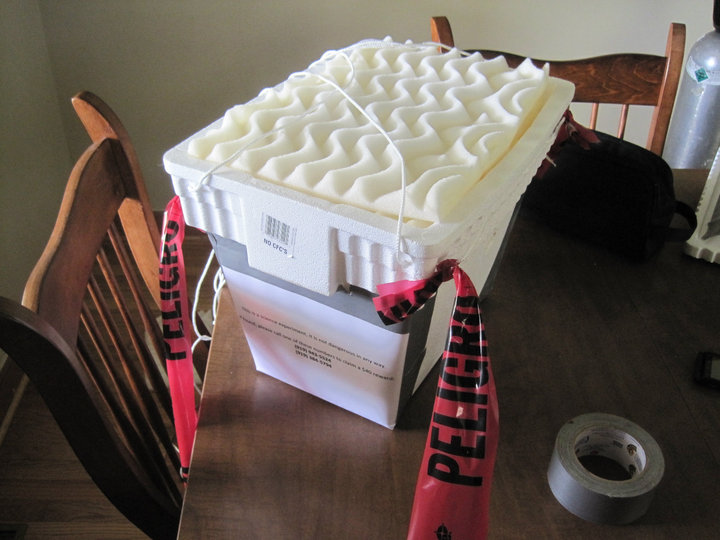

The cooler just before we sealed it off for the launch.
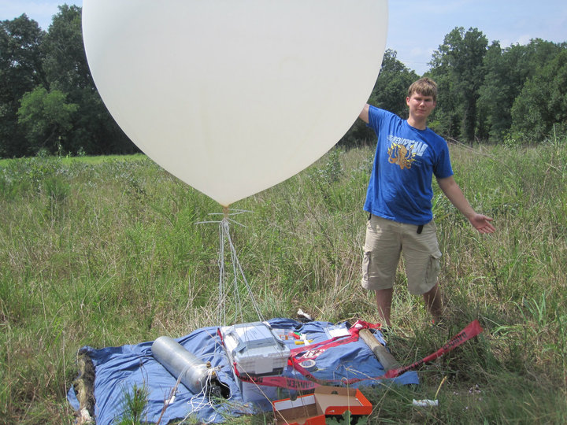

The entire project ready to go.  At this point the balloon was full, the phone
was tracking, and the camera was recording.
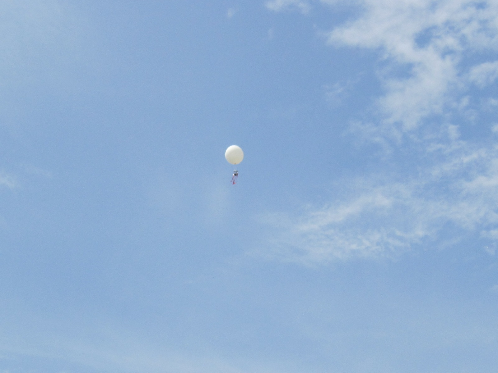

A successful launch!

UPDATE (8/21/2011): Payload Found!!
===================================
On August 12, 2011 - nearly a year after our launch - my brother got a call from
someone who had found our payload. When he picked it up, it had traveled over a 
mile from its original landing site. The cooler looked completely destroyed, but
the camera's SD card was still intact. Below I've posted a few of the images
from the flight as well as a timelapse video of the entire flight.

Here's the first image from the flight - you can see our payload and some of the
staging area.
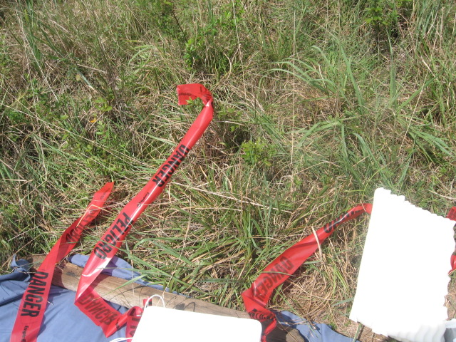

One of the pictures taken during the process of inflating the balloon.
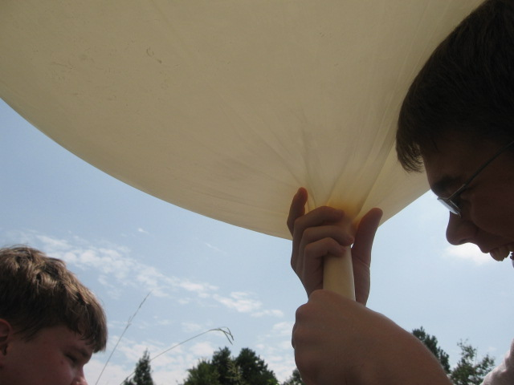

An image at a relatively low altitude - just high enough to see my brother's house.
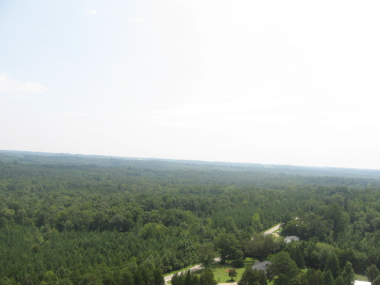

A few more images from the ascent...
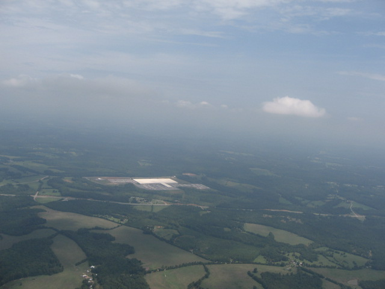

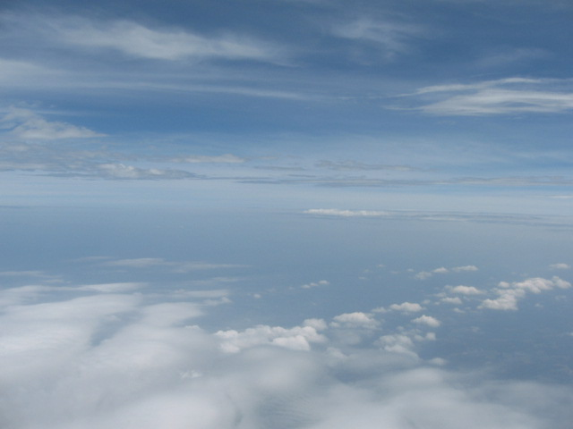

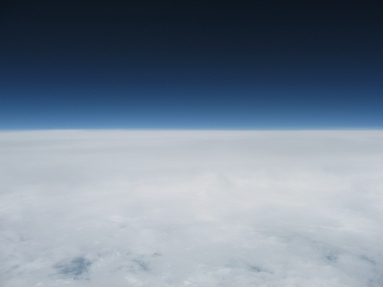

The last image before the balloon popped and the payload plummeted back to
earth.
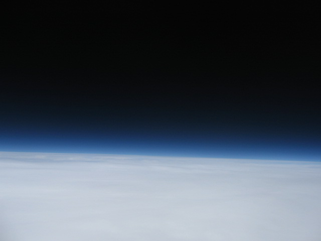

The last image from the entire flight.  It shows the payload's final resting place - in a tree.
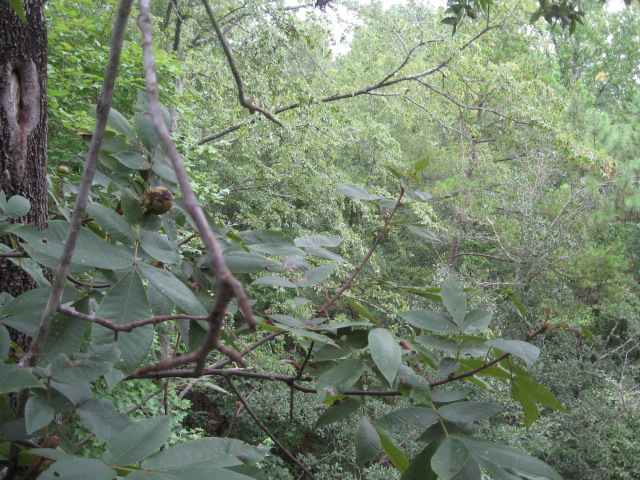

Timelapse
---------

<iframe src="http://player.vimeo.com/video/27751339?title=0&amp;byline=0&amp;portrait=0" width="600" height="450" frameborder="0"></iframe>

